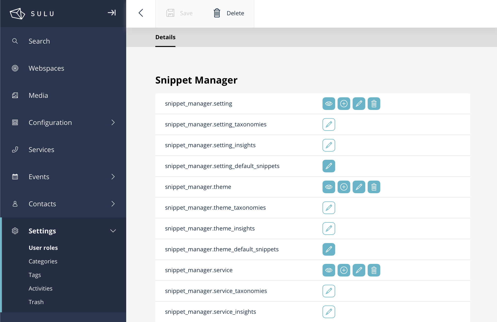

# SuluSnippetManagerBundle
The SuluSnippetManagerBundle adds configurable snippet-based navigation items to the Sulu Admin interface. This allows you to organize snippets by type and permissions within the native Sulu Admin UI.

<p style="display: flex; gap: 32px; justify-content: center;">
    <a href="docs/navigation-items.png" target="_blank">
        
    </a>
    <a href="docs/rights-management.png" target="_blank">
        
    </a>
</p>

## Features
- Custom navigation items for different snippet types
- Optional nested navigation items (e.g. under a main “Configuration” item)
- Independent permission handling per snippet type and snippet navigation item

# Installation
## Install the bundle via composer:

```
composer require perspeqtive/sulu-snippet-manager-bundle
```

## Enable the bundle

Register it in your config/bundles.php:

```
return [
// ...
    PERSPEQTIVE\SuluSnippetManagerBundle\SuluSnippetManagerBundle::class => ['all' => true],
];
```

# Configuration
Create a configuration file at `config/packages/sulu_snippet_manager.yaml`. Here you define how and where your snippet navigation items appear in the Sulu Admin UI.

Example configuration:
```
sulu_snippet_manager:
    navigation:
        configuration:
            navigation_title: "Configuration" 
            order: 39
            icon: "su-news"
            children:
                settings:
                    navigation_title: "Settings"
                    type: "settings"
                    order: 0
                    icon: "su-settings"
                account:
                    navigation_title: "Account Settings"
                    type: "account"
                    order: 1
                    icon: "su-account"
        services:
            navigation_title: "Services"
            type: "services"
            order: 41
            icon: "su-services"
```

## Configuration keys explained:

| config item      |         required          | description                                                                                                                                     |
|:-----------------|:-------------------------:|:------------------------------------------------------------------------------------------------------------------------------------------------|
| navigation_title |            yes            | Label shown in the Sulu Admin navigation                                                                                                        |
| order            |            yes            | Sort order position                                                                                                                             |
| icon             |            no             | Sulu icon name (e.g. su-settings, see [icon overview](https://jsdocs.sulu.io/2.5/#!/Icon))                                                      |
| type             |            yes            | The snippet type, when it is not a nested parent item. When it is a parent item, it is not required                                      |
| children         |            no             | Nested navigation items — parent items with children act as groups without detail views, parents without children behave like normal list views |


## Permissions
Each snippet automatically receives its own permission key. These permissions are independent from the global snippet permissions in Sulu.

You can assign user roles to control access (view, add, edit, delete) to each snippet separately.

Users without the required permission won’t see the corresponding navigation item in the Sulu Admin UI.
